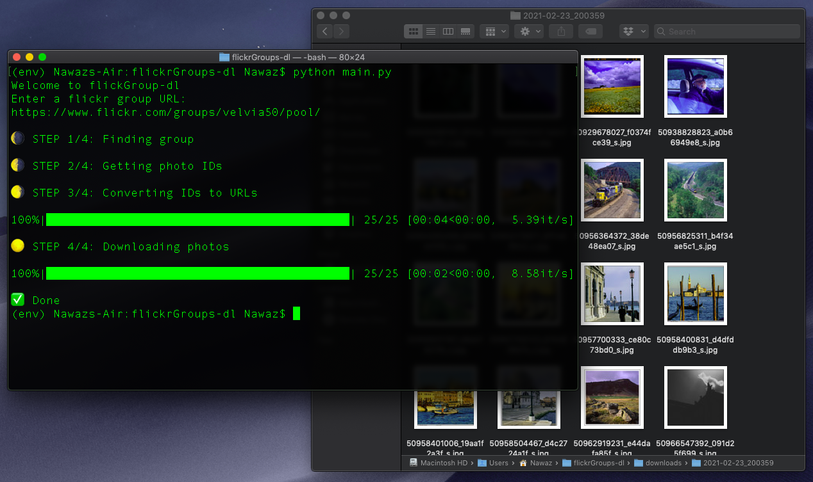

# flickrGroups-dl



While the name Flickr may harbor feelings of nostalgia, the site is still very much alive. This project is a command line tool that helps users bulk download images from Flickr groups.

Why? Flickr has a trove of images that have been uploaded of the years, and it's groups have curated these images in fascinating ways. Examples include "subject" based groups (portraits, cats, lighthouses), as well as "technical" groups (photos take with a specific camera, or film stock).

Using these groups one can easily create their own datasets.

## Installation 

Ensure you have Python 3.6+ installed, then simply clone this repository as you would normally:

```
git clone https://github.com/ngafar/flickrGroups-dl.git
cd flickrGroups-dl
```

From there install the project dependencies:

```
virtualenv env 
pip install -r requirements.txt
```

Then to run the program:

```
python main.py
```

**HOLD UP!** Before you can use the program you have to add your API key. Keep reading to see how.

## Setup

You'll need an API key from Flickr. [Get one here](https://www.flickr.com/services/), it's free.

Once you have an API key, paste it into `secrets-sample.py`, and rename it to `secrets.py`.

## Settings

In `settings.py` you'll find some parameters that can be adjusted.

* `NUMBER_OF_IMGS`: The number of images you want to download
* `SIZE`: Currently set to 0, have to do more research on this